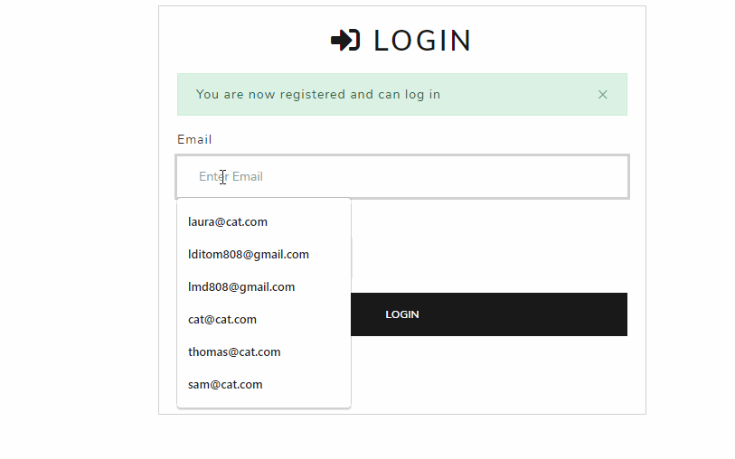
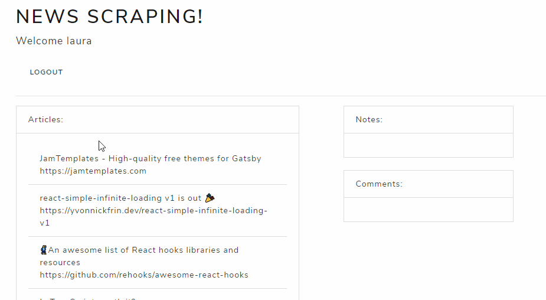
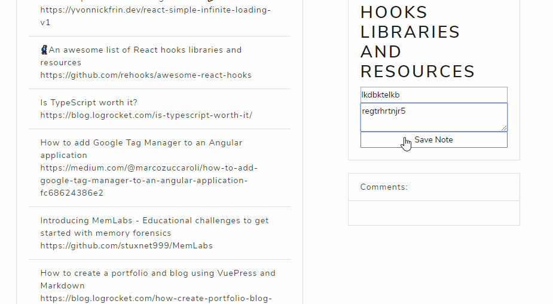

# news-scrape-
Scraping Video Pages for Updates 

# scraped-news-network
Web Scraping project that scrapes articles from Slate and allows users to leave comments on each article.

## Using the Project
The homepage will display the articles

## Deployed Version 
* Navigate to: https://blooming-refuge-34479.herokuapp.com

## Local Usage
* Clone this repo to your computer
* In the project directory, run `$npm install`
* Edit `PORT` and `DB` configuration if necessary/desired 
* Run `npm start` or `node app` to start your server and use this project on your own

## About
* This project implements the mongoose ORM to store and send information that has been scraped from another site, and information that has been input by users on the site  
* Below are some gifs demoing of the interface:
* 
* 
* 

## Future Work 
* It may not look like much but this project has a lot of more room to grow. 
* While it may not be CNN it offers at this point plenty of room for growth in terms of user auth. and user interfacing. 
* the last major goal of this project will be to put user names and time stamps to the projects. 

# 'Minders
*The project may look different in the future!

## Built With
* [Javascript](https://www.javascript.com/) - The scripting language used to manipulate the DOM. 
* [Passport](https://www.npmjs.com/package/passport) - Authentication middleware for node   
* [Bsalt](https://www.npmjs.com/package/bcryptjs) - Lightweight library for hashing and comparing passwords. 
* [Morgan](https://www.npmjs.com/package/morgan) - Logging middleware for node.js http apps. 
* [Axios](https://www.npmjs.com/package/axios) - Promise based HTTP client for Node (ajax of the server)
* [Cheerio](https://www.npmjs.com/package/cheerio) - A subset of jQuery created for implementation on server-side vs client side. 
* [Heroku](https://www.heroku.com/)- Cloud platform which builds databases and websites deployed online. 
* [Node](https://nodejs.org/en) - Javascript run-time environment (used to execute server side code.)
* [Express](https://www.npmjs.com/package/express) - Node package used as middleware to create routes.
* [EJS](https://www.npmjs.com/package/EJS) - Node package used as middleware to create page templates. Comparable to express-handlebars.
* [HTML5](https://developer.mozilla.org/en-US/docs/Web/Guide/HTML/HTML5) - Mark up language used for structuring pages. 

## Contributors
Laura DiTommaso - [lmd808](https://github.com/lmd808)